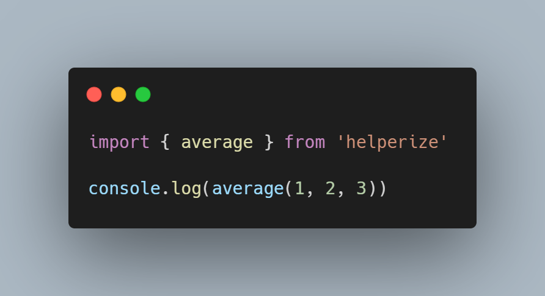

# 🚀 Helperize


Introducing Helperize, a comprehensive TypeScript NPM package with essential utility functions for various project requirements. Dive into a versatile toolkit to enhance your TypeScript coding experience. 🚀

## ⚡ Installation

It's that simple! - The only thing you need to do before using Helperize is installing in with your package manager.

```bash
npm i helperize
```

## ✨ Usage

Just import the functions of your choice, and you're good to go.



## ⚙️ Functions

- average()
- calculatePercent()
- capitalize()
- copyToClipboard()
- factorial()
- getRandomItem()
- insert()
- isEmpty()
- isEqual()
- isEven()
- isPalindrome()
- pluck()
- removeDuplicates()
- reverse()
- shuffle()
- sortBy()
- titleCase()
- truncate()
- validateEmail()
- wait()

## 🌐 License

This software is licensed under the [MIT License](https://github.com/piaseckijulian/Helperize/blob/main/LICENSE)
